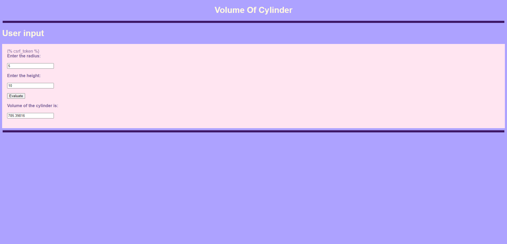

# Design a Website for Server Side Processing

# AIM:

To design a website to perform mathematical calculations in server side.

# DESIGN STEPS:

## Step 1:
Desing your website for calculation using wireframe work


## Step 2:
Then to execute the wireframe work desing use html,css


## Step 3:
Use views.py to execute the coding in serverside


## Step 4:
Mention the path of the website in urls.py


## Step 5:
Publish the website in the given URL


# PROGRAM:
index.html
```
<!DOCTYPE html>
<html>
    <head>
        <title>Volume Of Cylinder</title>
    <style>
        *{
            box-sizing: border-box;
            font-family:Arial;
            }
        body{
            background-color: #ADA2FF;
        }
        h1{
            color: #FFF8E1;
        }
        .main{
            padding: 1%;
            background-color: #FFE5F1;
            color: #7F669D;
        }

    </style>
    </head>
    <body>
        <h1 align="center">Volume Of Cylinder</h1>
        <hr align="center" size="10" width="1900" color="#3D1766"> 
        <h1>User input</h1>
        <div class = "main">
            <form method="POST">
                <br>
                <b><label for = "radius">Enter the radius: </label><br><br></b>
                <input type = "number" name = "radius" id = "radius" placeholder="give the radius of cylinder" required><br><br>
                <b><label for = "height">Enter the height: </label><br><br></b>
                <input type = "number" name = "height" id = "height" placeholder="give the height of cylinder" required><br><br>
                <button type="submit" id = "eval" onclick="alert('Server side process has started')">Evaluate</button><br><br>
                <b><label for = "areaofcyl">Volume of the cylinder is: </label><br><br></b>
                <input type = "number" name = "volume" id = "volume" value = " "><br><br>
            </form>
        </div>
        <hr align="center" size="10" width="1900" color="#3D1766">  
    </body>
</html>
```
views.py
```
from django.shortcuts import render

# Create your views here.
def volumeofcy(request):
    context = {}
    context['volume'] = "0"
    context['radius'] = "0"
    context['height'] = "0"
    if request.method == 'POST':
        r = request.POST.get('radius', '0')
        h = request.POST.get('height', '0')
        volume = 3.14 * (int(r)**2) * int(h)
        context['volume'] = volume
        context['radius'] = r
        context['height'] = h
    return render(request, "index.html", context)
```
urls.py
```
from django.contrib import admin
from django.urls import path
from serversideapp import views

urlpatterns = [
    path('admin/', admin.site.urls),
    path('volume/', views.volumeofcy)
]
```
# OUTPUT:


# RESULT:
The program is executed succesfully


